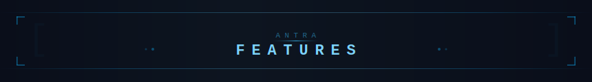

<p align="center">
  
</p>

<p align="center">
  <a href="README.md">← Back to README</a> &nbsp;·&nbsp;
  <a href="https://github.com/anandprtp/Antra/releases">Download</a> &nbsp;·&nbsp;
  <a href="https://ko-fi.com/antraverse">Support Development</a>
</p>

<br/>

---

## Multi-Source Audio Engine

Antra resolves links from Spotify, Apple Music, Amazon Music, Tidal, Qobuz, and Deezer. In lossless mode it queries all active lossless-capable sources and picks the result with the highest bit depth and sample rate — not just the first match found. Lossy formats (AAC, MP3) use dedicated lossy sources first; lossless adapters are only tried as a last resort.

```
Source chain (per track):

  Antra mirror servers  →  Tidal · Qobuz · Amazon Music · Deezer · Apple Music
  Built-in fallbacks    →  lossy and source-specific fallback adapters
  Soulseek P2P          →  anything the community has, including rare and out-of-print releases
```

Downloads from Antra mirror servers require an **Antra Access Key**, generated inside the app in Settings. Each key is valid for **24 hours or 2000 songs**, and a fresh key can be requested after 24 hours.

---

## ISRC-Based Exact Matching

Most tools match by title + artist and often grab the wrong version: a remaster, a radio edit, a regional pressing. Antra uses **ISRC codes** (the unique identifier of every recording) to guarantee you get the exact track from the exact release you requested.

When ISRCs are available, Antra uses them to match against source APIs directly. When they're not, it falls back to a scored similarity search with title-artist weighting.

---

## Explicit Version Preference

If the track you requested is the explicit (unedited) version, Antra will prefer it. Radio edits and censored versions are penalised in the match scoring and skipped when a clean result is the only option, keeping the rest of the queue searching until an explicit source is found.

Configurable in Settings: **Prefer explicit versions** (on by default).

---

## Hi-Res Awareness

Tidal and Qobuz expose per-track bit depth and sample rate in their search results. When a track has a hi-res master available (e.g. 24-bit/96kHz from Tidal, up to 24-bit/192kHz from Qobuz), Antra keeps searching all lossless-capable sources and selects the highest-resolution result — ranked by bit depth first, then sample rate. CD quality (16-bit/44.1kHz) is only used if no hi-res source can be located.

---

## Auto-Tagging

Every downloaded file is tagged automatically. No manual editing, no missing artwork, no "Track 01".

| Tag | Source |
|---|---|
| Title, Artist, Album, Track # | Spotify / Apple Music / Amazon metadata |
| Album artwork | Full-resolution cover from the streaming catalog |
| Release date | Full ISO date where available; year as fallback |
| Genre | MusicBrainz lookup via ISRC |
| Lyrics | Genius + Musixmatch fallback |
| ISRC | Embedded for future matching |

Tags are written in the correct format for every container: ID3v2 for MP3, Vorbis comments for FLAC, MP4 atoms for M4A, fully readable by Windows Media Player, VLC, foobar2000, and all major media servers.

---

## Smart Library Organisation

Output is structured the way every media server expects:

```
~/Music/
└── Artist Name/
    └── Album Name (Year)/
        ├── 101 - Track Title.flac
        ├── 102 - Track Title.flac
        └── cover.jpg
```

All tracks use disc-prefixed numbering (`101`, `102`, ..., `201`, `202`, ...) so Plex, Navidrome, and Jellyfin always know which disc a track belongs to — single-disc albums use the `1xx` prefix, multi-disc albums use `1xx` / `2xx` / etc.

### Folder Structure Options

| Mode | Layout |
|---|---|
| **Standard** (default) | `Artist / Album / files`. Optimal for Navidrome, Jellyfin, Plex. |
| **Flat** | `Album / files` directly inside your Music folder. No artist or category subdirectories. |

### Filename Format Options

| Mode | Example |
|---|---|
| **Default** | `101 - Track Title.flac` |
| **Title only** | `Track Title.flac` |
| **Artist - Title** | `101 - Artist - Track Title.flac` |
| **Title - Artist** | `101 - Track Title - Artist.flac` |

Both options are set during first-run setup and adjustable later in Settings.

---

## Smart Deduplication

Antra builds an identity index of your library using ISRCs, track IDs, and normalised title+artist keys. Before downloading, it checks if a track already exists, even if it was saved under a different artist folder name or album edition.

### Library Mode Options

| Mode | Behaviour |
|---|---|
| **Smart Dedup** (default) | Skip a track if the same ISRC exists anywhere in your library. Saves storage. |
| **Full Albums** | Skip only if the file already exists in the same destination folder. Lets you own the same track across multiple album contexts. |

---

## Artist Discography Download

Search for any artist by Spotify or Apple Music URL. Antra fetches their full discography and presents it grouped by release type.

- Browse **Albums**, **Singles**, **EPs & Compilations** separately
- Bulk-select or deselect entire groups with one click
- Queue individual albums or the full catalogue in one batch

---

## Spotify Podcast Downloads

Paste any Spotify podcast episode or show URL and Antra downloads the audio directly — no account required. Episodes are tagged with title, show name, description, and cover art, and saved alongside your music library.

---

## Parallel Download Engine

Antra downloads 2 tracks concurrently by default. Playlists and albums that would take minutes sequentially complete in a fraction of the time.

```
Sequential:   track 1 → track 2 → track 3 → ...
Parallel:     track 1 ↘
              track 2 → done
              track 3 ↗
```

---

## Rich Tracklist UI

When a URL is pasted, the full tracklist appears immediately before any download starts.

Each row shows the track title, artist, duration, and a real-time progress bar as the file downloads. The playlist header displays the cover art, type (ALBUM / PLAYLIST / SINGLE), artist, track count, total duration, and release date in the same layout as a streaming app.

When multiple URLs are queued in one session, a divider with the album cover and title separates each batch so you always know which tracks belong where.

A dedicated log panel (accessible via the 📋 button) shows verbose download output without disrupting the tracklist view.

---

## Source Health Check

Chips below the URL bar show the status of each configured source. Each chip displays whether the adapter is **enabled** (green glow, brand-tinted background) or **disabled** (dark red border, dimmed). Clicking a chip opens that adapter's settings section; clicking a disabled chip also toggles it on and saves the config. Parallel health probes confirm your account credentials are reachable and show a live/total count with per-endpoint status dots.

---

## Library History

Every completed download session is saved to history with its cover art thumbnail, album/playlist title, URL, track count, and timestamp, so you can quickly identify what you've downloaded without opening the folder.

---

## Built-in Spectrogram Analyzer

Not sure if a file is genuinely lossless or an MP3 in a FLAC wrapper? Drop any audio file into the Analyzer to see its full frequency spectrum. A real FLAC recorded from lossless masters looks unmistakably different from a transcoded lossy file.

Supports batch analysis with gallery view, side-by-side comparison, and PNG export.

---

## Access Key & Optional Accounts

Antra’s default download flow uses Antra mirror servers plus the in-app **Antra Access Key**. You generate the key once in Settings and Antra saves it automatically. For most users, that is all the setup required.

Optional premium logins are still available for services that support direct account-based downloads or metadata workflows.

| Item | What it does | Notes |
|---|---|---|
| **Antra Access Key** | Unlocks mirror-server downloads | Generated in Settings. Valid for 24 hours or 2000 songs. |
| **Tidal login** | Optional direct premium integration | Useful for premium account flows and OAuth-based setup. |
| **Qobuz login** | Optional direct Qobuz access | Used when you want your own Qobuz credentials active. |
| **Amazon Music login** | Optional browser-based account capture | Requires an L3/L1-certified `.wvd` file for decryption. |
| **Apple Music login** | Optional Apple browser session capture | Apple downloads in Antra are AAC-only. |
| **Spotify** | Metadata + podcast audio | No music-track audio from Spotify itself. |
| **Soulseek** | Optional P2P fallback | Good for rare or out-of-print releases. |

Spotify, Apple Music, Amazon Music, Tidal, Qobuz, and Deezer links are all supported as input URLs.

---

## TIDAL Premium OAuth Integration

For users with a premium TIDAL account, Antra offers a native device-code OAuth flow to securely connect your account without dealing with fragile API keys or manual session tokens. 

- **One-click login**: Click "Login with TIDAL" to generate a secure device code and verification URL.
- **Auto-save**: Approve the login in your browser, and Antra will automatically capture, validate, and store your session tokens.
- **Robust token handling**: Say goodbye to `SyntaxError`s from manually pasting JSON blobs. Antra sanitises all inputs and correctly manages the token lifecycle.

---

## Soulseek / P2P Integration

For tracks that aren't available through any streaming-adjacent source (rare albums, limited pressings, out-of-print releases), Antra integrates with the Soulseek P2P network.

**Zero setup.** Antra downloads, configures, and manages the backend automatically. Just provide your Soulseek credentials once on first run.

> The Soulseek network runs on sharing. If you use it, please share back and leave the client running when you can.

---

## Spotify Podcast Downloads

Antra can download any Spotify podcast episode or entire show directly using your own Spotify account cookie — no external server, no third-party proxy.

### Account requirement

A **free Spotify account is sufficient**. Podcast audio is not gated behind Spotify Premium. The 320 kbps OGG Vorbis format is available to all logged-in users. You only need to be signed in to Spotify in a browser to get the required cookie.

> The only exception is **subscriber-only episodes** — episodes paywalled by the podcast creator (separate from Spotify Premium). Those will fail with "no audio files available."

### Supported URLs

| URL type | Example |
|---|---|
| Single episode | `https://open.spotify.com/episode/4rOoJ6Egrf8K2IrywzwOMk` |
| Full show (all episodes) | `https://open.spotify.com/show/0ofXAdFIQQRsCYj9754UFx` |

Paste either URL into the main input bar and click Download — the same as any music URL.

### Setup: getting your sp_dc cookie

1. Open **[open.spotify.com](https://open.spotify.com)** in any browser while logged in to your Spotify account
2. Open **DevTools** → **F12** (Chrome/Edge) or **Cmd+Option+I** (macOS)
3. Go to **Application** tab → **Cookies** → `https://open.spotify.com`
4. Find the cookie named **`sp_dc`** — copy its value (starts with `AQ…`)
5. In Antra, open **Settings → Spotify Podcasts** and paste the value into the **sp_dc cookie** field
6. The indicator turns green: **● Cookie configured — podcast downloads enabled**

The cookie is valid for approximately **one year**. If downloads start failing with an auth error, repeat the steps above to refresh it.

### Output and tagging

Episodes are saved inside your configured Music folder:

```
~/Music/
└── Podcasts/
    └── Show Name/
        ├── 2024-03-15 - Episode Title.ogg
        ├── 2024-03-22 - Another Episode.ogg
        └── ...
```

Files are tagged automatically:

| Tag | Value |
|---|---|
| Title | Episode title |
| Artist | Show name |
| Album | Show name |
| Date | Publication date (YYYY-MM-DD) |
| Track number | Episode number (where available) |
| Comment/Description | Episode description (first 500 chars) |
| Artwork | Episode or show cover image |

### Audio quality

Antra always picks the highest quality format the episode offers:

| Format | Codec | Bitrate | Extension |
|---|---|---|---|
| OGG_VORBIS_320 | Ogg Vorbis | 320 kbps | `.ogg` |
| OGG_VORBIS_160 | Ogg Vorbis | 160 kbps | `.ogg` |
| MP4_128 | AAC | 128 kbps | `.m4a` |
| OGG_VORBIS_96 | Ogg Vorbis | 96 kbps | `.ogg` |

Most modern Spotify podcasts are available at 320 kbps OGG Vorbis. OGG and M4A are widely supported by VLC, foobar2000, Plex, Jellyfin, and all major podcast apps.

### Rate limiting

To protect your Spotify account from being flagged, Antra applies automatic rate limiting:

- **3–7 second random delay** between each episode download
- **50 episodes per hour** hard cap — Antra pauses and resumes automatically if the limit is reached

For large shows (100+ episodes) this means downloads take time. Leave Antra running in the background — it will complete the queue without any intervention.

---

## Audio Format Options

| Mode | Output |
|---|---|
| **FLAC 24-bit** | Highest available lossless source, prioritising hi-res where available. |
| **FLAC 16-bit** | CD-quality lossless, with 16-bit sources preferred over 24-bit where possible. |
| **ALAC** | Apple-compatible lossless output. |
| **AAC** | Native AAC sources first, lossless only as fallback when needed. |
| **MP3** | Native MP3/lossy sources first, lossless only as fallback when needed. |
| **Auto** | Best available source with lossless preferred. |

---

## Platform Support

All builds ship as **single self-contained binaries** with no Python, no runtime, and no dependencies to install.

| Platform | Minimum | File |
|---|---|---|
| Windows | 10+ | `Antra.exe` |
| macOS | 12+ (Apple Silicon) | `Antra-macOS.dmg` |
| macOS | 12+ (Intel) | `Antra-macOS-Intel.dmg` |
| Linux | Any | `Antra-Linux.AppImage` |

---

## Tech Stack

```
Desktop shell   →  Go 1.23 · Wails v2
Frontend UI     →  Svelte · TypeScript · Vite
Download engine →  Python 3.11
IPC             →  newline-delimited JSON over stdout
Packaging       →  PyInstaller · wails build · AppImage · create-dmg
CI/CD           →  GitHub Actions, 4-platform matrix build on tag push
```

---

<p align="center">
  <br/>
  <strong>Antra is free and open source, maintained by one person in their spare time.</strong><br/>
  <em>If it saves you money on streaming, consider keeping it alive.</em>
  <br/><br/>
  <a href="https://ko-fi.com/antraverse">
    
  </a>
  &nbsp;
  <a href="https://github.com/anandprtp/Antra">
    
  </a>
  &nbsp;
  <a href="https://t.me/antraaverse">
    
  </a>
  <br/><br/>
  <sub><a href="README.md">← Back to README</a></sub>
</p>
